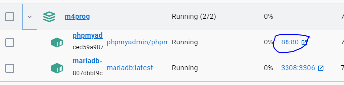
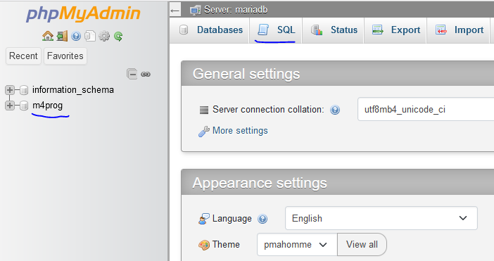
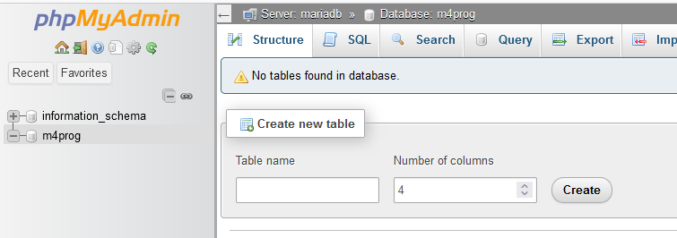

## php admin opstarten

- zorg dat je docker aanstaat
    - click dan op de `88:80`
    

- je krijgt dan het volgende scherm in je browser te zien:
    
> let even op de met *blauw* onderlijnde items
> - `m4prog` dat is je database `schema` voor deze lessen
> - `SQL`, dat is waar je `SQL statements `kan uitvoeren/proberen

## schema bekijken

- click nu op `m4prog` om het schema te openen
    
    - je zit nu `in` het `schema`
        - alles wat je daar doet gaat `alleen` op de m4prog 
        > (m4prog is nu het `active` schema)