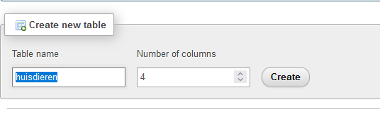
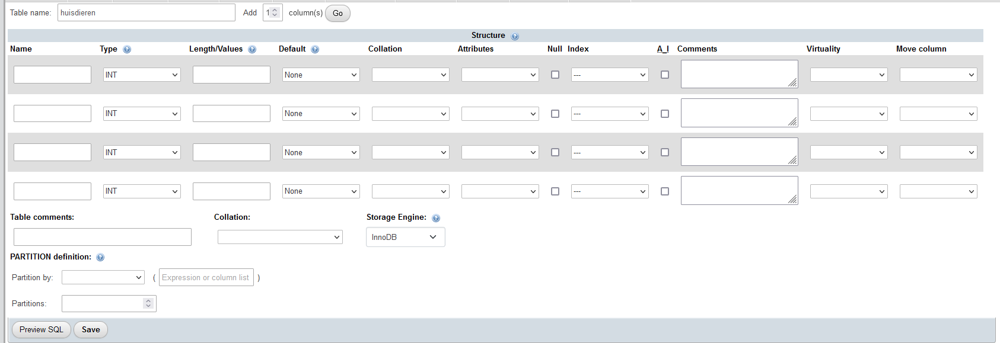
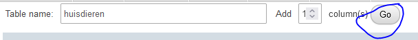
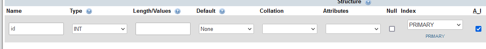
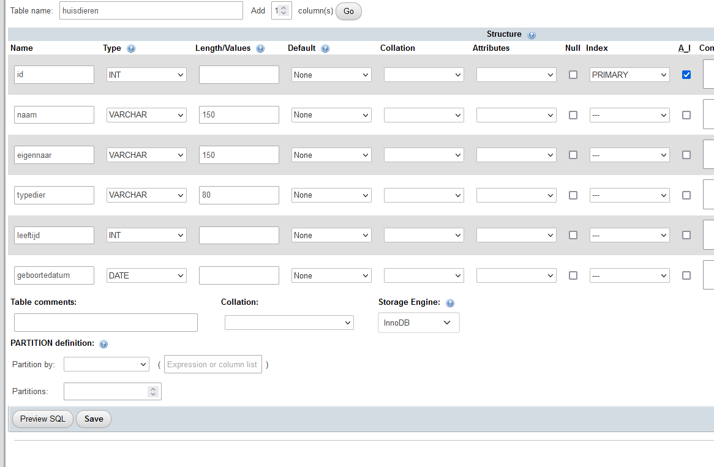
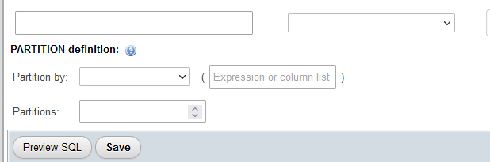
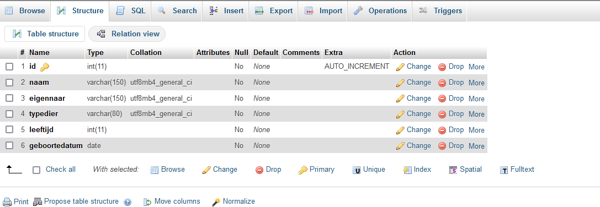
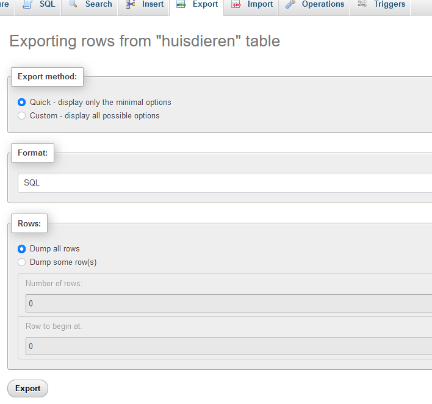
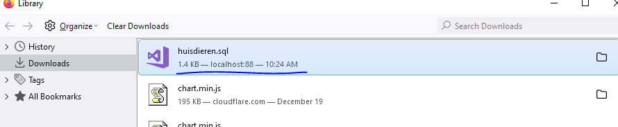
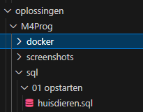

## tabel aanmaken

- click nu op `m4prog` om het schema te openen
 > 

- vul nu `huisdieren` in als `table name`
 > 

- nu zie je een groot scherm
> 

> - elke rij is 1 `colom`
>   - `colommen` zijn `eigenschappen` van het `ding` wat in de `table` komt
> voor onze huisdieren gebruiken we de `volgende` eigenschappen:
>   - `naam`
>   - `eigenaar`
>   - `typedier`
>   - `leeftijd`
>   - `geboortedatum`

- dat zijn 5 eigenschappen we hebben maar 4 rijen:
    - click op `GO` achter `Add`
    > 
    - doe dat nu nog 1 keer, want we hebben nog 1 eigenschap:
        - de `id` van de `rij` in de `tabel`
            > dit noemen we de `primary key`
    
## eigenschappen maken

- kijk goed naar de wat waar ingevuld moet worden
    - de belangrijke voor nu zijn:
        > - `Name` (naam van de eigenschap)
        > - `Type` (wat voor soort data zit er in? denk nummers, zinnen, > datums?)
        > - `Length` (hoeveel data mag erin)
        > - `Null` (mag het veld leeg zijn, vaak is dit NEE dat mag niet)
        > - `A_I`, autogenerated voor primary keys en indices

- We beginnen met de ID:
    
    - vul onder `Name` *id* in
    - vul onder `Type` *INT* in
    - vink `A_I` aan    
    > 

## de rest

- laten we naam ook nog even samen doen:
    - vul onder `Name` naam in
    - vul onder `Type` varchar in
        > dit is een string (zin) van een variabele lengte
    - zet `Length` voor nu even op `150`
        > de naam mag nu maximaal `150` letters/cijfers (*characters*) bevatten
- maak nu voor de rest ook colommen aan:
>   - `eigenaar` (varchar van 150)
>   - `typedier` (varchar van 80)
>   - `leeftijd` (int)
>   - `geboortedatum` (date)

- check of het goed staat:
    > 
- click op save
    > 

- nu zie je het volgende:
    > 

## uhmm wat als ik docker delete?

> dan raak je je table en data ook kwijt

- ga naar `export`
    > 
    - `druk` op de `export` knop    
        - je download nu een `sql file`
            > 
            - zet deze in je `sql` directory als `huisdieren.sql`
            > 

## klaar?

- commit & push naar je git
            