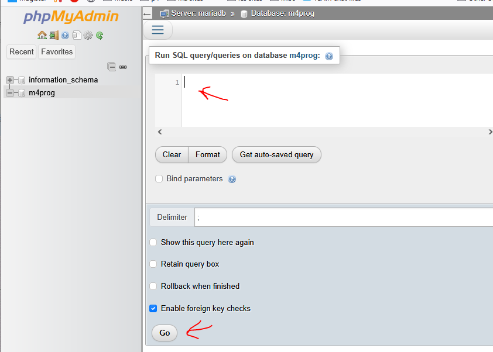

## delete

- delete je M4Prog in docker desktop

- maak die opnieuw aan met je docker-compose

## sql

- open je phpmyadmin
- ga naar `m4prog` dan `sql`
    > 

## herstellen

- zoek je `huisdieren.sql` uit de vorige oefeningen

- plak de sql uit `huisdieren.sql` in het sql window
- druk op go
    > 

## klaar?

- commit & push naar je git
            